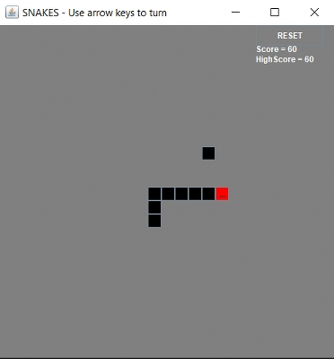
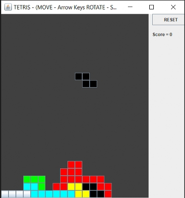
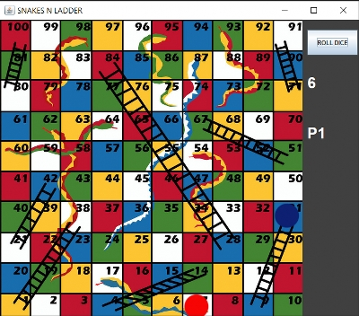
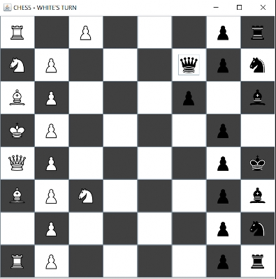
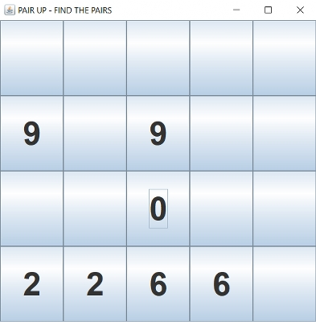
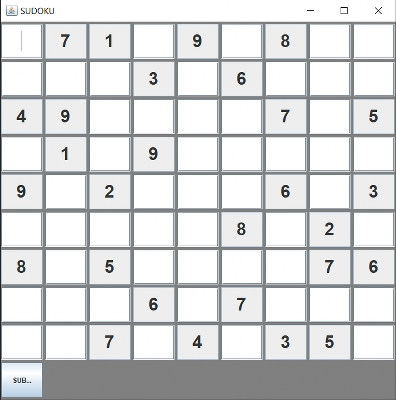
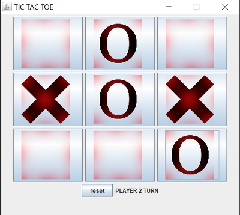

# Java Swing Games
Includes :
1. Snakes
1. Tetris
1. Snakes and Ladder
1. Chess
1. Pair Up
1. Sudoku
1. Tic Tac Toe
---
## To run using source files :
* Change relative paths to images if using Ubuntu
* Compile and run **Main.java**

## Jar File included to run directly. (Requires JRE)
---
## Description of Games :
### **Snakes**
* Play your favourite childhood game. 
* Eat as much as you can, but dont eat yourself.
* Highscores are recorded and kept safe.
```
Use Arrow Keys to control the snake.
```

### **Tetris**
* Complete as many lines as you can by fitting random blocks.
```
Use Arrow Keys to control the movement and Space Bar to rotate the block.
```

### **Snakes and Ladder**
* 2 Player Game
* Players get chance one by one to roll the dice.
```
Click the roll die button to roll it. 
P1 / P2 indicates whose chance it is.
```

### **Chess**
* 2 Player Chess game with all the rules implemented
```
First Click to select the Piece , and next to Place it
Title Bar indicates whose turn it is.
```

### **Pair Up**
* Pair up matching symbols in the hidden boxes
```
First Click to select one box, next to select its pair
```

### **Sudoku**
* Try to solve a Math Puzzle where sum of each row , column and 3x3 square is same and no number should repeat in them
```
Use mouse and keyboard to select box and fill number
At last click SUBMIT to check
```

### **Tic Tac Toe**
* 2 Player Game
* Win by first completing a row / diagonal / column with your symbol.
```
Use mouse to play chances
```

---
---